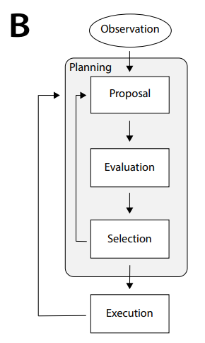

# 阅读随笔：Coginitive Architectures for Language Agents

Paper link: https://arxiv.org/abs/2309.02427.

Document created on Nov. 11th, 2024.

## 一些思考

阅读本篇论文主要也是为了了解一下认知架构（Cognitive Architecture）相关的研究。
相比于强化学习，我认为认知架构的发展更能让 AI 接近人类的思考方式。~~RL out!~~

本人认为，未来的 AI 应用应当是系统级的（表现为以下特征：模块化设计，状态机，异步线程推理，自主学习，数据库等）。
这也是我研究认知架构的原因。

如今 AI 的发展路径真的对吗？
纵观如今 AIGC 和 LLM 的发展：
AIGC 的可控性和稳定性是短板，为了弥补这些短板，甚至衍生出了诸多如提示词工程（Prompt Engineering）的工程（~~这明明就是语文工程~~；
而 LLM 仅仅作为语言模型，没有状态的设计（stateless），却靠 Special Token 和堆积历史记录的方式暴力解决状态的问题和一些任务。
我认为，我们需要一些更加结构化的设计，比如引入状态，推理，记忆设计。不过，我们也需要感谢如今的 AI 发展为我们创造了许多优秀的轮子（）

人类的思考永远是 AI 的研究可以借鉴的对象。AI 的研究并不像其他理科的研究一样无迹可循，至少目前来说，我们的发展目标是开发出接近人类的智能。

## Paper 简介

这篇论文总结了前人的 Symbolic Cognitive Architecture，并提出了一个新的概念性的认知架构框架：CoALA，并且就几个方面进行了介绍和讨论。

## CoALA 介绍

顾名思义，CoALA 是一个基于语言模型的认知架构，其架构设计如下：

决策过程如下：

### Memory

下面将分别介绍 CoALA 的几种记忆。

- **Working Memory** 可以理解为 CoALA 的总线状态。
它与架构的各个部分进行通信，比如与外界环境交互，与记忆模块交互，与 LLM 交互。
因此，它包含了架构的整体的状态，并且充当连接各模块的桥梁。

- **Episodic Memory** 存放 CoALA 的经验信息。
比如一些 LLM 的对话历史记录，一些经验片段等等。可以为任务提供一些“shot”。

- **Semantic Memory** 存放 CoALA 的知识。
比如一些关于世界上一些事物的常识，以及关于智能体自身的知识。

- **Procedural Memory** 是运行过程中没有被模块化的记忆。
包括隐式的在 LLM 权重中的记忆，和显式的在智能体代码中写入的记忆。
比如机器人三定律，可以写在智能体代码中。

### Actions

下面将分别介绍 CoALA 的几种动作。

- **Grounding Actions** 用于与外部环境交互。
外部环境包括：物理环境，对话，数字环境。

- **Retrieval Actions** 用于从长期记忆中检索记忆。

- **Reasoning Actions** 用于更新 working memory，完成推理。

- **Learning Actions** 可以更新 CoALA 的记忆，LLM 参数，智能体代码等，以达成学习的效果。

### Decision-Making

CoALA 的决策过程是一个循环执行的过程。大致可以分为两个阶段：

#### Planning Stage

- **Proposal** 通过 reasoning 生成一些候选的动作。

- **Evaluation** 通过 LLM 对输入进行推理生成一些结果，用于下一步的决策。

- **Selection** 从可用的动作空间中根据评估的 value 选择最终的动作。

#### Execution

Execution 将会执行 grounding action 到外部环境，并获取外部反馈，而且会在内部执行 learning action。然后重复整个循环。

## Insights

论文也对架构的设计给出了自己的可行的见解，这些或许将为以后的研究工作指明方向。论文中提到了：

- 模块化智能体
- 明确设计智能体
- 结构化推理
- 长期记忆
- 自主学习
- 动作空间
- 决策

具体可以去查阅论文。

## 论文小结

本论文提出了一个概念性的框架 CoALA。架构的设计从前人的符号架构中汲取了灵感，将 LLM 结合到了认知架构中。
希望这篇研究可以提供一个开发更通用，更接近人类的人工智能的道路。

## 相关调研

就目前来说，NLP 中 LLM 的研究无疑是最热门，最接近通用人工智能（AGI）的领域。
从 LLM 出发，首当其冲的就是要解决不能长期持续运行的能力，这依赖于长期记忆的课题。
接下来，我会对一些研究展开调研，并提出一些个人的见解。

先说说我理想中记忆机制的形态：

智能体外部有个独立的大容量记忆数据库，模型可以高效率地从数据库中检索记忆。
并且记忆的容量，质量问题可以自动通过增删改维护。

### 相关论文

MemGPT: https://arxiv.org/abs/2310.08560

提出了一种层级记忆架构，通过 instructional prompts，加入对话上下文到模型输入，并引导 LLM 对记忆架构执行存储，检索，中断等操作。

LongMem: https://arxiv.org/abs/2306.07174

提出了一种存储历史注意力状态的方法，并训练一个可以融合历史注意力状态和模型前向隐藏层状态的 SideNet。
